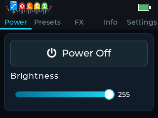
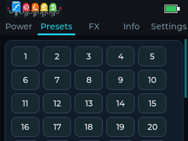

# WLED Touch Remote

A touchscreen remote for WLED running on the capacitive ESP32 Cheap Yellow Display.

It gives you a small dedicated controller for power, brightness, presets, colors, and WLED effects over ESP-NOW. No Wi-Fi connection is needed after pairing; the display talks directly to your WLED controller.



## What It Does

- Power on/off and brightness control
- Presets in a simple touch-friendly layout
- Optional Extended mode for more presets, effects, palettes, speed, intensity, and color controls
- On-device settings for screen orientation, idle behavior, and Basic/Extended mode
- Help screens with QR codes for setup instructions
- Web installer support for easy browser flashing

## Flash It

The easiest way is the [web installer](https://figamore.github.io/wled-touch-remote/):

1. Open the GitHub Pages installer for this project.
2. Connect the CYD with a data-capable USB cable.
3. Click Install and choose the ESP32 serial port.

Use Chrome or Edge on desktop. Web Serial requires HTTPS, so use the published GitHub Pages page rather than opening `index.html` directly.

If the browser cannot connect, hold the CYD `BOOT` button while selecting the serial port, then release it once flashing starts.

## Pair With WLED

1. Open your WLED controller in a browser.
2. Go to `Config -> WiFi Setup`.
3. Enable ESP-NOW remote control.
4. Boot WLED Touch Remote and tap any control.
5. In WLED, copy the remote's `Last Seen` MAC into the `Hardware MAC` field.
6. Save and reboot WLED if prompted.

The Info tab on the remote also shows the MAC address you need.


## Basic Mode

Basic mode works with WLED's built-in ESP-NOW remote behavior. You get:

- Power
- Brightness
- Presets 1-7
- Settings and Info screens

This mode does not require uploading any extra files to WLED.



## Extended Mode

Extended mode unlocks the richer controls. To use it, upload [`remote.json`](https://raw.githubusercontent.com/figamore/wled-touch-remote/main/remote.json) to your WLED controller as `/remote.json`.

In WLED:

1. Open `http://<wled-ip>/edit`
2. Upload `remote.json`
3. On the remote, open Settings
4. Enable Extended mode

Extended mode adds more preset buttons, WLED effects, effect settings, palette controls, and large color swatches.


## Settings

The Settings tab lets you change:

- Display orientation
- Idle behavior: dim, turn off, or always on
- Basic or Extended mode

Settings are saved on the ESP32 and restored after reboot.


## Supported Hardware

This project targets capacitive ESP32 Cheap Yellow Display boards, especially ESP32-2432S028C-style CYDs.

The firmware can auto-detect the common capacitive touch controllers used by these boards:

- ST7789 display + CST816S touch
- ILI9341 display + FT5x06 touch

Resistive-touch CYDs are not currently supported.

# Development

## Building Locally

Install PlatformIO, then run:

```sh
pio run -e esp32-cyd-capacitive
pio run -e esp32-cyd-capacitive -t upload
```

## macOS Simulator

A native SDL simulator is included for screenshots and UI checks:

```sh
brew install sdl2
pio run -e macos
.pio/build/macos/program --screenshots
```

Screenshots are written to `screenshots/`.

## Contributing

Issues and pull requests are welcome. Please keep changes focused, touch-friendly, and friendly to the small 320x240 screen.

Useful areas for contributions:

- UI polish
- Documentation
- Hardware compatibility reports for capacitive CYD variants
- New features
