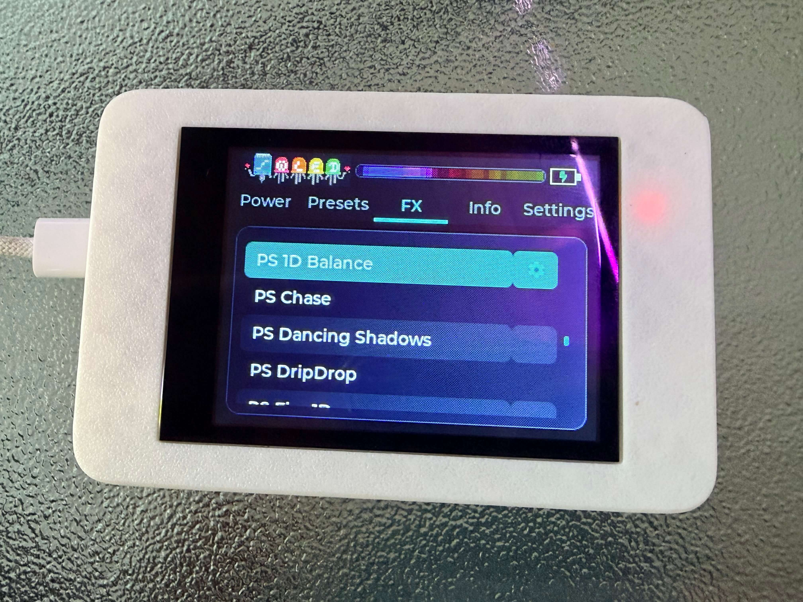
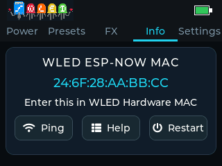
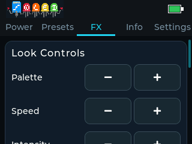
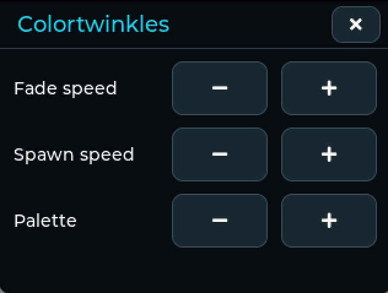
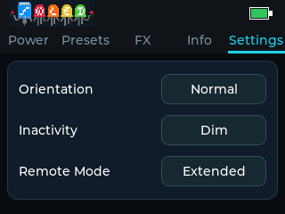
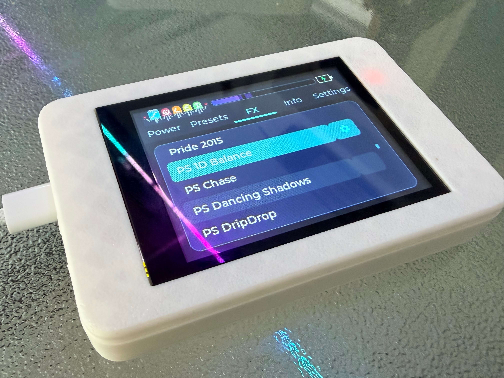
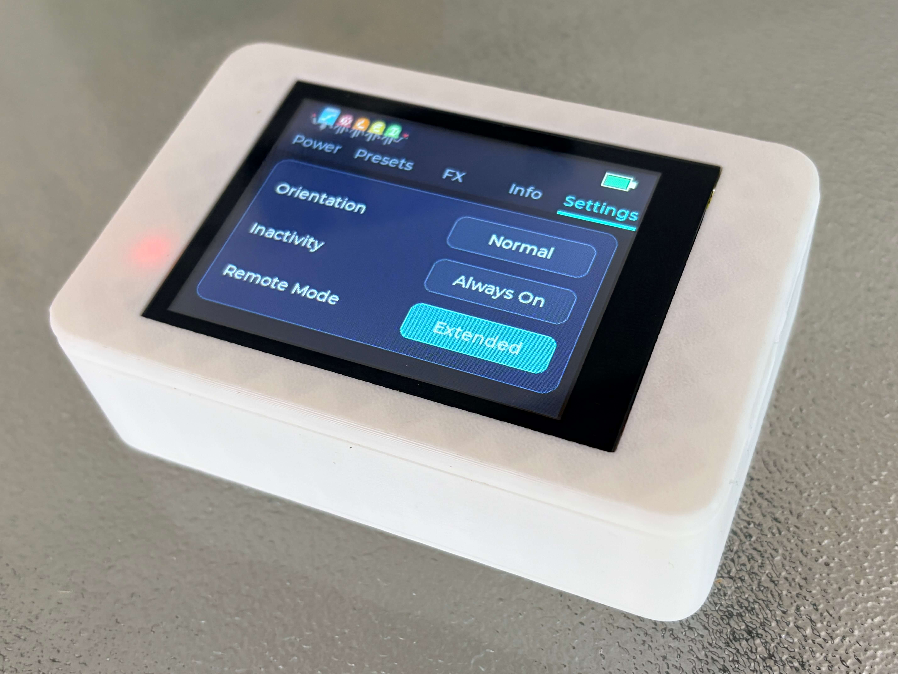
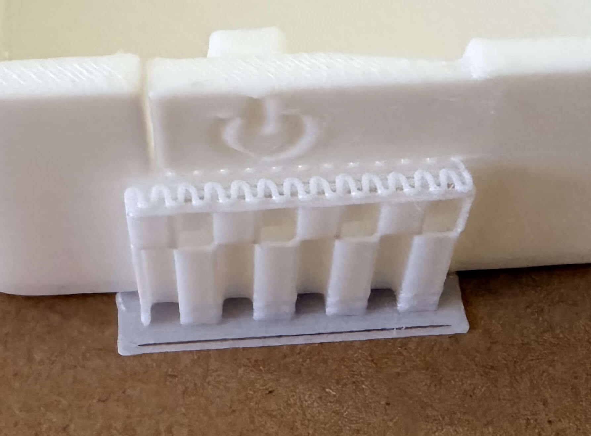
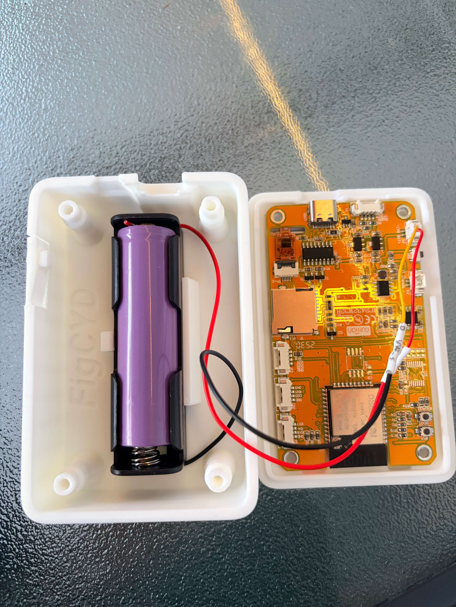
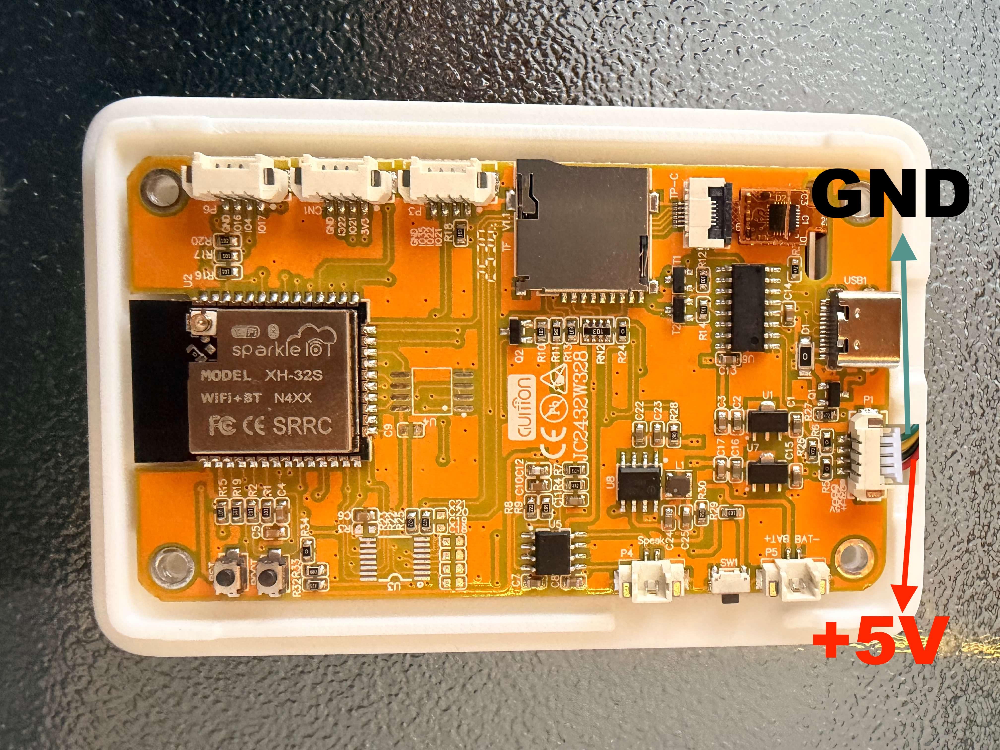

# WLED Touch Remote

A wireless-capable, touchscreen remote controller for WLED running on the ESP32 Cheap Yellow Display (CYD).

It gives you a small dedicated controller for power, brightness, presets, colors, and WLED effects over **ESP-NOW**, a wireless protocol. No Wi-Fi connection is needed after pairing; the display talks directly to your WLED controller. It can run off 5V or wirelessly using an 18650 Li-Ion battery cell.

> **Hardware note:** the default firmware supports common capacitive and resistive CYD boards. On first boot, setup asks you to tap the screen and saves the detected touch hardware.



## Features

- Power on/off and brightness control
- Preset selection
- Optional, easy-to-configure [extended mode](#extended-mode) for up to 20 presets, effects, palettes, speed, intensity, and color controls
- On-device settings for screen orientation, idle behavior (dim, always off/on), and Basic/Extended mode
- Help screens with QR codes for setup instructions
- Web installer support for easy browser flashing

## Flash It

The easiest way is the [web installer](https://figamore.github.io/wled-touch-remote/):

1. Open the [web installer](https://figamore.github.io/wled-touch-remote/)
2. Connect the CYD with a data-capable USB cable.
3. Click Install and choose the ESP32 serial port.

## Pair With WLED

1. Open your WLED controller in a browser.
1. Go to `Config -> WiFi & Network`.
1. Enable ESP-NOW remote control.
1. copy the MAC from the `Info` tab into WLED's `Linked MACs` field.
1. Save and reboot WLED if prompted.



## Basic Mode

Basic mode works with WLED's built-in ESP-NOW remote behavior. You get:

- Power
- Brightness
- Presets 1-7
- Settings and Info screens

This mode does not require uploading any extra files to WLED.

## Extended Mode

Extended mode unlocks the richer controls. To use it, upload [remote.json](https://raw.githubusercontent.com/figamore/wled-touch-remote/main/remote.json) to your WLED controller as `/remote.json`.

In WLED:

1. Open `http://<wled-ip>/edit`
2. Upload [remote.json](https://raw.githubusercontent.com/figamore/wled-touch-remote/main/remote.json)
3. On the remote, open Settings
4. Enable Extended mode

Extended mode adds more preset buttons, WLED effects, effect settings, palette controls, and large color swatches.




## Communication Notes

WLED's ESP-NOW remote protocol is one-way unless WLED itself is modified. The remote sends commands to WLED, but WLED does not send status, delivery confirmation, or live LED data back to the remote.

Because of that, on-screen state is based on the last action sent from the remote. Effect peek/preview animations are local estimates intended to help identify effects; they are not live previews from the WLED controller.

## Settings

The Settings tab lets you change:

- Display orientation
- Idle display behavior: dim, turn off, or always on
- Basic or Extended mode

Settings are saved on the ESP32 and restored after reboot.



## Supported Hardware

This project targets ESP32 Cheap Yellow Display boards, especially the Guition JC2432W328C / ESP32-2432S028C-style capacitive CYD and ESP32-024 / ESP32-2432S028-style resistive CYD.

The default firmware can auto-detect the common capacitive touch controllers used by these boards:

- ST7789 display + CST816S touch
- ILI9341 display + FT5x06 touch

On first boot, the firmware shows a one-time touch setup screen so it can confirm the touch hardware.

## 3D Printed Case

Optional snap-fit cases are available on MakerWorld:

[FigCYD CYD case with optional battery](https://makerworld.com/en/models/2964422-figcyd-cyd-case-with-optional-battery#profileId-3323586)

Choose one of the two case styles from MakerWorld:

- **Slim case**: for a clean remote without an internal battery.



- **Battery case**: for a portable, fully-wireless build with an 18650 Li-Ion cell and holder.



Assembly notes:

1. Print the case parts from MakerWorld (choose either slim or battery variant).
2. Press the CYD into the front shell, checking that the USB-C port, reset button, and side button line up.
3. Snap the back shell into place. Bolts are optional because the case is snap-fit, but they are recommended for a more secure build.
   - **Slim**: 4 M3x10 bolts
   - **Battery**: 4 M3x20 bolts

If you are building the slim case, you can stop here. Continue only for the battery case:

1. Remove the printed supports from the button opening, bolt holes, and battery holder area.
2. Free the side power-button piece and make sure it moves smoothly before installing the CYD.
3. Install the 18650 holder and route the wires carefully so they do not pinch when the case closes.




The slim case can be powered through USB-C, or through the board's `GND` and `5V` connector as shown below.



**Battery operation instructions**

- Double tap the power button to **turn on**.
- Hold the power button for 10 seconds to **turn off**.
- If a USB cable is connected while running on battery, the device may restart. This is normal behavior for the CYD battery circuitry.
- Double-check polarity before powering the board. The case photos show the intended wiring path and board orientation.

# Development

## Building Locally

Install PlatformIO, then run:

```sh
pio run -e esp32-cyd
pio run -e esp32-cyd -t upload
```

## macOS Simulator

A native SDL simulator is included for screenshots and UI checks:

```sh
brew install sdl2
pio run -e macos
.pio/build/macos/program
```

## Contributing

Issues and pull requests are welcome. Please keep changes focused, touch-friendly, and friendly to the small 320x240 screen.

Useful areas for contributions:

- UI polish
- Documentation
- Hardware compatibility reports for CYD variants
- New features

See [Acknowledgements](ACKNOWLEDGEMENTS.md) for related projects and libraries that helped shape this project.
